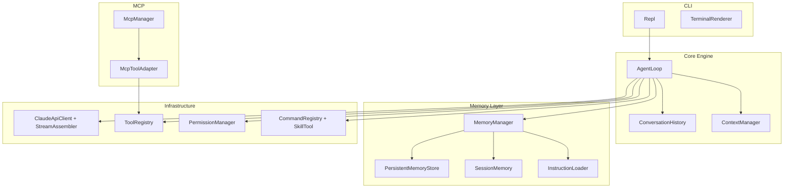

<div align="center">

# Claude Code Java

### A Java-built Claude Code style coding agent, rebuilt for learning

<p>
  <a href="https://schhaohao.github.io/docs/">
    
  </a>
  
  
  
</p>

一个面向学习、拆解和复现的 AI Coding Agent 项目。它不只是“调用 Claude API”，而是把一条真正的 Agent 工程链路完整做出来：

**Agent Loop、Tool Use、Streaming、Permission、Skill、MCP，以及现在已经接入的 Memory System。**

<p>
  <a href="https://schhaohao.github.io/docs/">学习文档</a>
  ·
  <a href="./claude-code-java">源码目录</a>
</p>

</div>

---

## Why This Repo

很多 AI 项目把关键机制藏在抽象后面，能跑，但不方便学。

这个仓库的目标刚好相反：

> 把一个 Claude Code 风格的 Coding Agent 拆开来做，让你能真正看懂它为什么这样工作。

如果你想系统学习这些主题，这个项目会非常合适：

- Agent Loop 如何驱动“推理 → 调工具 → 回灌结果 → 继续推理”
- Claude Messages API 和 Tool Use 协议怎么接
- 命令行 AI 助手如何做权限控制与终端交互
- Skill 系统如何把 Prompt 工程变成可复用能力
- MCP 如何把外部 server 透明接成工具
- Memory / Context Compression 如何进入真实主循环

---

## Highlights

### `Agent Loop`

模型不是一次性吐答案，而是在循环里持续工作：

```text
用户输入
  -> 构建请求(system + tools + messages)
  -> 调 Claude API
  -> 检查 stop_reason
  -> 如需 tool_use 则执行工具
  -> 把 tool_result 回灌给模型
  -> 继续循环直到任务完成
```

### `Streaming API`

基于 OkHttp + SSE，支持流式响应拼装与实时终端输出，而不是等整段内容生成完再一次性展示。

### `Tool System`

内置了 Coding Agent 最常用的基础工具能力：

- 文件读取
- 文件编辑
- 文件写入
- Shell 执行
- 文件名搜索
- 内容搜索

### `Permission Layer`

把高风险操作放进 Human-in-the-loop 审批链，避免“模型能调用工具”直接等于“模型能随便执行操作”。

### `Skill System`

通过 `SKILL.md` 定义可复用技能，让模型不只是临场发挥，而是可以“按剧本执行”。

### `MCP Integration`

支持接入外部 MCP Server，把远程能力统一适配为本地工具。

### `Memory System`

这是当前版本最重要的升级之一，已经具备：

- 持久化记忆：`MEMORY.md + frontmatter Markdown 文件`
- 相关记忆检索：按用户请求挑选 relevant memories
- 多层 `CLAUDE.md` 指令加载
- Session Memory：长会话结构化摘要
- 三层上下文压缩：
  - `L1` 微压缩旧 `tool_result`
  - `L2` 用 Session Memory 替换中期历史
  - `L3` 用摘要折叠更老历史

---

## What’s Implemented

当前项目已经具备一条完整的 Coding Agent 基础链路：

- `ClaudeApiClient + StreamAssembler`
- `AgentLoop`
- `ConversationHistory + ContextManager`
- `ToolRegistry + Built-in Tools`
- `PermissionManager`
- `CommandRegistry + SkillTool`
- `McpManager + McpToolAdapter`
- `MemoryManager + memory/*`

同时，记忆层已经不是“旁路工具类”，而是主流程的一部分，会参与：

- 请求前动态 system prompt 构建
- 请求前上下文压缩
- 工具调用计数
- 回合结束后的 Session Memory 刷新

---

## Project Layout

核心源码位于：

```text
OwnCode/claude-code-java/
```

主要模块如下：

```text
claude-code-java/src/main/java/com/claudecode/
├── ClaudeCode.java              # 程序入口
├── core/                        # Agent Loop / 对话历史 / 上下文管理
├── api/                         # Claude API 客户端与响应模型
├── tool/                        # Tool 接口、注册中心、内置工具
├── command/                     # Skill / Command 系统
├── mcp/                         # MCP 客户端、管理器、适配器
├── permission/                  # 权限系统
├── cli/                         # REPL 与终端渲染
└── memory/                      # 记忆系统（重点模块）
```

完整讲解请直接看在线文档：

- [https://schhaohao.github.io/docs/](https://schhaohao.github.io/docs/)

---

## Architecture Snapshot



---

## Quick Start

### 1. Build

```bash
cd claude-code-java
mvn clean package
```

### 2. Configure API access

当前代码读取的是这些环境变量：

```bash
export CCJ_API_KEY="your-api-key"
export CCJ_BASE_URL="https://your-api-host.com"   # optional
```

也可以通过命令行传入：

```bash
java -jar target/claude-code-java-1.0-SNAPSHOT.jar \
  --api-key your-api-key \
  --base-url https://your-api-host.com \
  --model claude-sonnet-4-6
```

### 3. Run

```bash
java -jar target/claude-code-java-1.0-SNAPSHOT.jar
```

### 4. Test

```bash
mvn test
```

---

## Skill System

项目支持通过 `SKILL.md` 定义高阶技能，让模型按预设提示词执行任务。

工作流大致如下：

```text
启动时扫描 ~/.claude-code-java/skills/ 和 .claude-code-java/skills/
  -> 解析 SKILL.md
  -> 注册到 CommandRegistry
  -> 生成 skill listing 注入 system prompt
  -> 用户通过 /name 或模型通过 SkillTool 调用
```

一个最简单的 Skill 示例：

```markdown
---
description: 审查代码质量和效率
allowed-tools:
  - Read
  - Bash
---

你是一个代码审查专家，请检查 $ARGUMENTS 中指定的文件...
```

---

## MCP Integration

项目支持通过 MCP 协议接入外部工具服务器，把远程能力无缝接入 Agent。

配置示例：

```json
{
  "mcpServers": {
    "filesystem": {
      "command": "npx",
      "args": ["-y", "@modelcontextprotocol/server-filesystem", "/tmp"],
      "env": { "NODE_ENV": "production" }
    }
  }
}
```

几个关键设计点：

- 适配器模式：远程工具被转换为本地 `Tool`
- 命名规范：`mcp__<serverName>__<toolName>`
- 安全优先：MCP 工具默认需要用户审批
- 容错隔离：单个 MCP Server 失败不影响整体启动

---

## Memory System

如果你之前看过这个项目，现在最值得重新关注的就是记忆层。

当前实现里已经有：

- `MemoryManager`
- `PersistentMemoryStore`
- `MemoryIndex`
- `RelevantMemoryRetriever`
- `InstructionLoader`
- `SessionMemory`
- `SessionMemoryExtractor`
- `TokenEstimator`
- `ConversationSummaryGenerator`

它们共同让 Agent 具备了更接近真实 Claude Code 的能力：

- 动态上下文构建
- 长会话状态沉淀
- 分层压缩
- 跨会话记忆基础设施

详细讲解请看：

- [记忆系统架构](https://schhaohao.github.io/docs/architecture/memory-system)

---

## Why It’s Worth Studying

这个项目最有意思的地方，不只是“它做了什么”，而是“它把关键机制写出来了”。

你可以在这里系统学习：

- Claude Messages API 的请求与响应模型
- SSE 流式处理
- Tool Use 协议
- 命令行交互式 Agent
- 权限系统
- Skill 与 Prompt 工程
- MCP 集成
- Memory / Context Compression

---

## Next Directions

如果继续往下做，这几个方向会非常自然：

- 增加 memory 相关 tool，让模型主动保存 / 删除记忆
- 把关键词检索升级成 LLM rerank
- 把 `SessionMemoryExtractor` 升级成模型提取
- 支持 `CLAUDE.md` 的 `@include`
- 做更细粒度的 memory 配置开关

---

## Stack

- Java 11
- OkHttp + SSE
- Jackson
- JLine3
- JUnit 5
- VitePress
- Mermaid

---

## License

MIT
