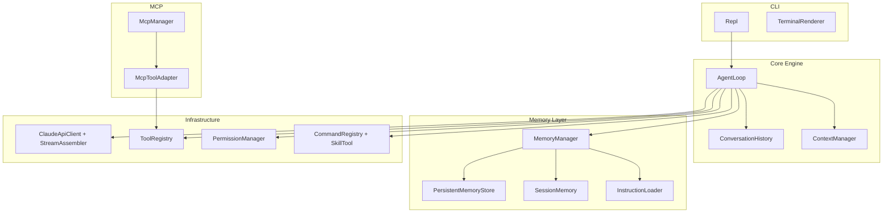

<div align="center">

# Claude Code Java

### 用 Java 复刻 Claude Code CLI 的一次完整工程实践

一个面向学习与拆解的 AI Coding Agent 项目：支持流式 Claude API、Agent Loop、Tool Use、Skill 系统、MCP 集成，以及现在已经接入的记忆系统与分层上下文压缩。

[学习文档](https://schhaohao.github.io/docs/) · [源码目录](./claude-code-java)

</div>

---

## 项目亮点

这不是一个“调用一下大模型接口”的小 Demo，而是一个尽量接近真实 Coding Agent 工作流的 Java 项目。

它已经具备这些核心能力：

- `Agent Loop`：模型思考、请求工具、接收结果、继续推理，直到任务完成
- `Streaming API`：基于 OkHttp + SSE 的流式 Claude 响应处理
- `Tool System`：文件读写、Shell、搜索等内置工具
- `Permission Layer`：需要风险控制的操作先做人类审批
- `Skill System`：用 `SKILL.md` 驱动“按剧本执行”的高阶任务
- `MCP Integration`：把外部 MCP Server 透明适配为本地工具
- `Memory System`：持久化记忆、Session Memory、动态 system prompt、三层上下文压缩

如果你在找一个适合学习这些主题的 Java 项目：

- Agent 工程如何落地
- Claude 风格 Tool Use 协议怎么接
- 命令行 AI 助手怎么组织模块
- Memory / Context Compression 怎么做

这个仓库就是为这件事准备的。

---

## 现在已经实现了什么

### 1. Coding Agent 核心闭环

```text
用户输入
  -> 构建请求(system + tools + messages)
  -> 调 Claude API
  -> 解析 stop_reason
  -> 如需 tool_use 则执行工具
  -> 把 tool_result 回灌给模型
  -> 继续循环直到 end_turn
```

### 2. 记忆系统

这次版本里，项目已经加入了完整的记忆骨架：

- 持久化记忆：`MEMORY.md + frontmatter Markdown 文件`
- 相关记忆检索：按当前用户请求挑选 relevant memories
- 指令文件加载：多层 `CLAUDE.md`
- Session Memory：长会话中的结构化摘要
- 上下文压缩：
  - `L1` 微压缩旧 `tool_result`
  - `L2` 用 Session Memory 替换中期历史
  - `L3` 用摘要折叠更老历史

### 3. 面向扩展的设计

项目里有不少地方已经按“后续可继续长大”的方式设计好了：

- `MemoryManager` 作为记忆门面
- `ConversationSummaryGenerator` 允许模型摘要与规则摘要自由替换
- `McpToolAdapter` 用适配器模式把远程工具接进本地体系
- `CommandRegistry + SkillTool` 把 Skill 与 Tool 体系桥接起来

---

## 仓库结构

这个仓库的核心源码位于：

```text
OwnCode/claude-code-java/
```

### `claude-code-java/`

Java 源码项目，核心目录大致如下：

```text
claude-code-java/src/main/java/com/claudecode/
├── ClaudeCode.java              # 程序入口
├── core/                        # Agent Loop / 对话历史 / 上下文管理
├── api/                         # Claude API 客户端与响应模型
├── tool/                        # Tool 接口、注册中心、内置工具
├── command/                     # Skill / Command 系统
├── mcp/                         # MCP 客户端、管理器、适配器
├── permission/                  # 权限系统
├── cli/                         # REPL 与终端渲染
└── memory/                      # 记忆系统（本次新增重点）
```

配套学习文档在线地址：

- [https://schhaohao.github.io/docs/](https://schhaohao.github.io/docs/)

---

## 架构速览



---

## 快速开始

### 1. 构建项目

```bash
cd claude-code-java
mvn clean package
```

### 2. 配置 API Key

当前代码读取的是这些环境变量：

```bash
export CCJ_API_KEY="your-api-key"
export CCJ_BASE_URL="https://your-api-host.com"   # 可选
```

也可以通过命令行传：

```bash
java -jar target/claude-code-java-1.0-SNAPSHOT.jar \
  --api-key your-api-key \
  --base-url https://your-api-host.com \
  --model claude-sonnet-4-6
```

### 3. 直接运行

```bash
java -jar target/claude-code-java-1.0-SNAPSHOT.jar
```

### 4. 运行测试

```bash
mvn test
```

---

## Skill 系统

项目支持通过 `SKILL.md` 定义高阶技能，让模型按预设提示词执行任务。

工作流如下：

```text
启动时扫描 ~/.claude-code-java/skills/ 和 .claude-code-java/skills/
  -> 解析 SKILL.md
  -> 注册到 CommandRegistry
  -> 生成 skill listing 注入 system prompt
  -> 用户通过 /name 或模型通过 SkillTool 调用
```

一个最简单的 Skill 示例：

```markdown
---
description: 审查代码质量和效率
allowed-tools:
  - Read
  - Bash
---

你是一个代码审查专家，请检查 $ARGUMENTS 中指定的文件...
```

---

## MCP 集成

项目支持通过 MCP 协议接入外部工具服务器，把远程能力无缝接入 Agent。

配置示例：

```json
{
  "mcpServers": {
    "filesystem": {
      "command": "npx",
      "args": ["-y", "@modelcontextprotocol/server-filesystem", "/tmp"],
      "env": { "NODE_ENV": "production" }
    }
  }
}
```

设计上的几个关键点：

- 适配器模式：远程工具被转换为本地 `Tool`
- 命名规范：`mcp__<serverName>__<toolName>`
- 安全优先：MCP 工具默认需要用户审批
- 容错隔离：单个 MCP Server 失败不影响整体启动

---

## 记忆系统是这次最重要的升级

如果你之前看过这个项目，现在最值得重新关注的就是记忆层。

当前实现里已经有：

- `MemoryManager`
- `PersistentMemoryStore`
- `MemoryIndex`
- `RelevantMemoryRetriever`
- `InstructionLoader`
- `SessionMemory`
- `SessionMemoryExtractor`
- `TokenEstimator`
- `ConversationSummaryGenerator`

它们共同让 Agent 具备了更接近真实 Claude Code 的能力：

- 动态上下文构建
- 长会话状态沉淀
- 分层压缩
- 跨会话记忆基础设施

详细讲解请直接看文档站里的：

- [记忆系统架构](https://schhaohao.github.io/docs/architecture/memory-system)

---

## 为什么这个项目值得学

很多 AI 项目会直接把“魔法”藏起来。

这个项目的目标恰好相反：

> 把 Agent 的关键机制拆开，让你能真正看懂。

你可以在这里系统学习：

- Claude Messages API 的请求/响应模型
- SSE 流式处理
- Tool Use 协议
- 命令行交互式 Agent
- 权限系统
- Skill 与 Prompt 工程
- MCP 集成
- Memory / Context Compression

---

## 接下来最自然的演进方向

如果继续往下做，这几个方向会非常有意思：

- 增加 memory 相关 tool，让模型主动保存/删除记忆
- 把关键词检索升级成 LLM rerank
- 把 SessionMemoryExtractor 升级成模型提取
- 支持 `CLAUDE.md` 的 `@include`
- 做更细粒度的 memory 配置开关

---

## 技术栈

- Java 11
- OkHttp + SSE
- Jackson
- JLine3
- JUnit 5
- VitePress
- Mermaid

---

## 许可证

MIT
